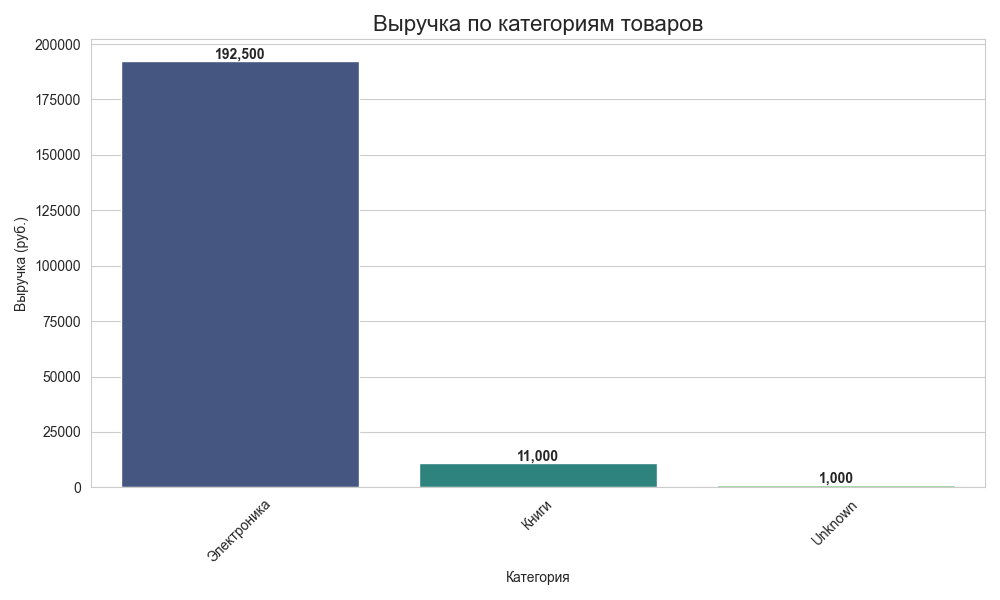
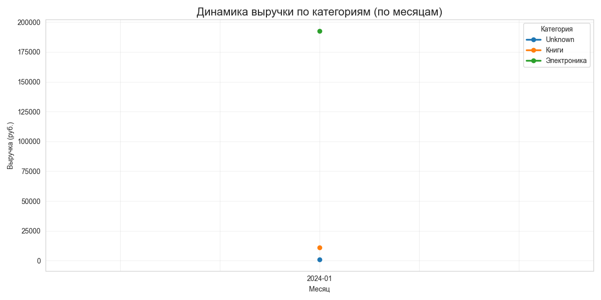
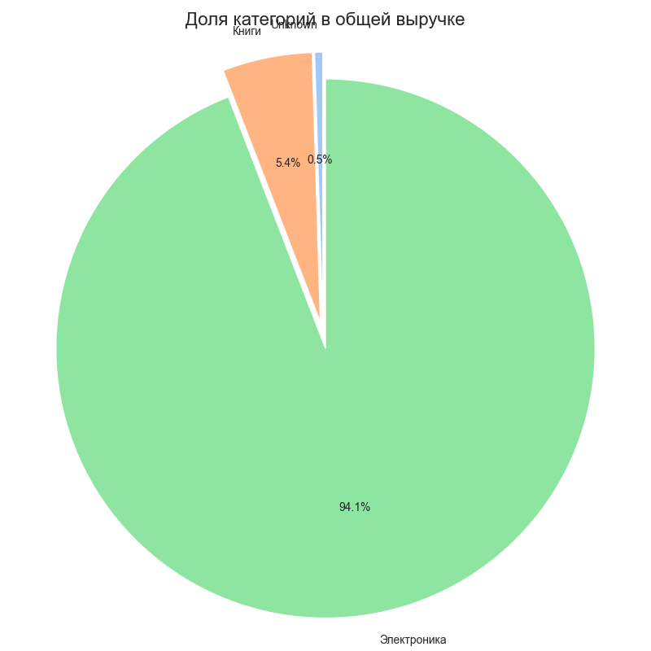

# Отчет по лабораторной работе №15 (часть 1)
# Простой ETL-пайплайн на Python

**Дата:** 06-05-2026  
**Семестр:** 2 курс, 2 полугодие (4 семестр)  
**Группа:** ПИН-б-о-24-1  
**Дисциплина:** Технологии программирования  
**Студент:** Герда Никита Андреевич

## Цель работы
Получить практические навыки построения ETL-пайплайна: извлечение данных из CSV, очистка и преобразование данных, агрегация, загрузка в базу данных SQLite и базовая визуализация результатов.

## Теоретическая часть
ETL (Extract, Transform, Load) — это процесс извлечения данных из источника, их преобразования (очистка, фильтрация, агрегация) и загрузки в целевую систему. В отличие от ELT, где трансформация выполняется после загрузки, в ETL данные очищаются до попадания в БД.  

**Основные этапы ETL:**
- **Extract** – чтение исходных данных (CSV, API, БД) с обработкой ошибок и проверкой структуры.
- **Transform** – удаление дубликатов, заполнение пропусков, фильтрация аномалий, приведение типов, создание вычисляемых полей.
- **Load** – загрузка очищенных и агрегированных данных в хранилище (в работе — SQLite).

В работе также реализован этап **Visualize** для наглядного анализа результатов.

## Практическая часть

### Выполненные задачи
- [x] **Extract:** Загрузка CSV с автоматическим определением кодировки (`utf-8` / `windows-1251`), обработка ошибок отсутствия файла, вывод статистики.
- [x] **Transform:** Удаление дубликатов, заполнение пропусков (числовые — медианой, текстовые — `'Unknown'`), фильтрация строк с `quantity <= 0` или `price_per_unit <= 0`, преобразование типов, добавление колонок `total_amount` и `month_year`.
- [x] **Aggregate:** Группировка по категории и месяцу с расчётом суммарного количества, выручки, средней цены и количества заказов.
- [x] **Load:** Сохранение в SQLite двух таблиц (`sales_cleaned`, `sales_aggregated`) с проверкой через SQL-запрос.
- [x] **Visualize:** Построение столбчатой диаграммы выручки по категориям, линейного графика динамики по месяцам, круговой диаграммы долей категорий.

### Ключевые фрагменты кода

**1. Извлечение с обработкой кодировки**
```python
def extract(self) -> pd.DataFrame:
    try:
        try:
            self.raw_data = pd.read_csv(self.csv_path, encoding='utf-8')
        except UnicodeDecodeError:
            self.raw_data = pd.read_csv(self.csv_path, encoding='windows-1251')
        if self.raw_data.empty:
            raise ValueError("CSV файл пуст")
    except FileNotFoundError:
        logger.error(f"Файл {self.csv_path} не найден")
        raise
    ...
```

**2. Очистка данных (трансформация)**
```python
# Заполнение пропусков с явным присваиванием для совместимости с новыми версиями pandas
df[col] = df[col].fillna(median_val)          # числовые
df[col] = df[col].fillna('Unknown')          # текстовые
# Удаление аномалий
df = df[(df['quantity'] > 0) & (df['price_per_unit'] > 0)]
# Добавление полей
df['total_amount'] = df['quantity'] * df['price_per_unit']
df['month_year'] = df['order_date'].dt.strftime('%Y-%m')
```

**3. Загрузка в SQLite (SQLAlchemy 2.0+)**
```python
from sqlalchemy import create_engine, text
...
self.cleaned_data.to_sql('sales_cleaned', engine, if_exists='replace', index=False)
self.aggregated_data.to_sql('sales_aggregated', engine, if_exists='replace', index=False)
with engine.connect() as conn:
    tables = conn.execute(text("SELECT name FROM sqlite_master WHERE type='table';")).fetchall()
```

**4. Визуализация (пример круговой диаграммы)**
```python
cat_total = self.aggregated_data.groupby('category')['total_revenue'].sum()
plt.pie(cat_total, labels=cat_total.index, autopct='%1.1f%%', ...)
plt.savefig('report/graphs/pie_chart.png')
```

## Результаты выполнения

### Пример работы программы
```
2026-05-06 02:44:46,369 - INFO - ==================================================
2026-05-06 02:44:46,369 - INFO - ЗАПУСК ETL ПАЙПЛАЙНА
2026-05-06 02:44:46,370 - INFO - ==================================================
2026-05-06 02:44:46,370 - INFO - ==================================================
2026-05-06 02:44:46,370 - INFO - НАЧАЛО ЭТАПА EXTRACT
2026-05-06 02:44:46,370 - INFO - UTF-8 не подошёл, пробуем windows-1251
2026-05-06 02:44:46,372 - INFO - Загружено 11 строк, 9 колонок
2026-05-06 02:44:46,372 - INFO - Колонки: order_id, order_date, product_name, category, quantity, price_per_unit, customer_name, customer_city, payment_method
2026-05-06 02:44:46,373 - INFO - Типы данных:
order_id          int64
order_date          str
product_name        str
category            str
quantity          int64
price_per_unit    int64
customer_name       str
customer_city       str
payment_method      str
2026-05-06 02:44:46,374 - INFO - Пропуски:
order_id          0
order_date        0
product_name      1
category          1
quantity          0
price_per_unit    0
customer_name     1
customer_city     1
payment_method    0
2026-05-06 02:44:46,375 - INFO - ==================================================
2026-05-06 02:44:46,375 - INFO - НАЧАЛО ЭТАПА TRANSFORM
2026-05-06 02:44:46,377 - INFO - Удалено дубликатов: 1
2026-05-06 02:44:46,378 - INFO - Колонка 'quantity': NaN до обработки 0, медиана 1.00
2026-05-06 02:44:46,378 - INFO - Колонка 'price_per_unit': NaN до обработки 0, медиана 2750.00
2026-05-06 02:44:46,378 - INFO - Колонка 'category': пропусков 1, заменены на 'Unknown'
2026-05-06 02:44:46,379 - INFO - Колонка 'product_name': пропусков 1, заменены на 'Unknown'
2026-05-06 02:44:46,379 - INFO - Колонка 'customer_name': пропусков 1, заменены на 'Unknown'
2026-05-06 02:44:46,381 - INFO - Колонка 'customer_city': пропусков 1, заменены на 'Unknown'
2026-05-06 02:44:46,381 - INFO - Колонка 'payment_method': пропусков 0, заменены на 'Unknown'
2026-05-06 02:44:46,382 - INFO - Удалено строк с аномалиями: 1
2026-05-06 02:44:46,385 - INFO - После очистки: 9 строк (удалено всего 2)
2026-05-06 02:44:46,385 - INFO - Диапазон дат: 2024-01-15 – 2024-01-19
2026-05-06 02:44:46,386 - INFO - ==================================================
2026-05-06 02:44:46,386 - INFO - НАЧАЛО ЭТАПА AGGREGATE
2026-05-06 02:44:46,391 - INFO - Агрегировано 3 групп
2026-05-06 02:44:46,395 - INFO -
      category month_year  total_quantity  total_revenue  avg_price  order_count
0      Unknown    2024-01               1         1000.0    1000.00            1
1        Книги    2024-01               4        11000.0    2833.33            3
2  Электроника    2024-01               8       192500.0   37600.00            5
2026-05-06 02:44:46,395 - INFO - ==================================================
2026-05-06 02:44:46,395 - INFO - НАЧАЛО ЭТАПА LOAD
2026-05-06 02:44:46,638 - INFO - Таблица 'sales_cleaned' сохранена (9 записей)
2026-05-06 02:44:46,877 - INFO - Таблица 'sales_aggregated' сохранена (3 записей)
2026-05-06 02:44:46,878 - INFO - Таблицы в БД: ['sales_cleaned', 'sales_aggregated']
2026-05-06 02:44:46,879 - INFO - Содержимое sales_aggregated:
2026-05-06 02:44:46,881 - INFO - ('Unknown', '2024-01', 1, 1000.0, 1000.0, 1)
2026-05-06 02:44:46,881 - INFO - ('Книги', '2024-01', 4, 11000.0, 2833.33, 3)
2026-05-06 02:44:46,882 - INFO - ('Электроника', '2024-01', 8, 192500.0, 37600.0, 5)
2026-05-06 02:44:46,882 - INFO - Данные загружены в sales.db
2026-05-06 02:44:46,883 - INFO - ==================================================
2026-05-06 02:44:46,884 - INFO - НАЧАЛО ЭТАПА VISUALIZE
D:\СКФУ\2 курс\технологии_программирования\lab15Gerda\etl\etl_pipeline.py:174: FutureWarning:

Passing `palette` without assigning `hue` is deprecated and will be removed in v0.14.0. Assign the `x` variable to `hue` and set `legend=False` for the same effect.

  ax = sns.barplot(x=cat_revenue.index, y=cat_revenue.values, palette='viridis')
2026-05-06 02:45:06,635 - INFO - Графики сохранены в report/graphs/
2026-05-06 02:45:06,635 - INFO - ==================================================
2026-05-06 02:45:06,639 - INFO - ETL ПАЙПЛАЙН УСПЕШНО ЗАВЕРШЁН
2026-05-06 02:45:06,640 - INFO - ==================================================
```

### Тестирование
- [x] Пайплайн корректно обрабатывает дубликаты и аномальные значения.
- [x] Пропуски заполнены, типы данных преобразованы.
- [x] База данных создана, таблицы заполнены, SQL-запросы выполняются без ошибок.
- [x] Визуализация формирует три графика с подписями и сохраняет их на диск.

## Выводы
1. Разработанный ETL-пайплайн успешно решает задачу очистки и агрегации данных о продажах.
2. При работе с CSV-файлами, созданными в Windows, важно учитывать кодировку (`windows-1251`).
3. Использование явного присваивания `df[col] = df[col].fillna(...)` обеспечивает корректную работу с современными версиями pandas.
4. Агрегация позволила наглядно увидеть распределение выручки по категориям: основную долю занимает «Электроника».
5. Визуализация помогает быстро интерпретировать результаты и выявлять аномалии (например, категорию с неизвестным товаром).

## Ответы на контрольные вопросы
1. **Какие аномалии и пропуски были обнаружены в исходных данных? Как вы их обработали?**  
   - Пропуски в текстовых полях (строка 1004) заменены на `'Unknown'`, числовые пропуски (если бы возникли) заполнялись бы медианой.  
   - Отрицательное количество (заказ 1005) – строка удалена, так как отрицательные продажи бессмысленны.  
   - Дубликат заказа 1010 удалён, чтобы избежать задвоения выручки.

2. **В чём разница между ETL и ELT? Какой подход для данной задачи?**  
   ETL выполняет трансформацию перед загрузкой в хранилище, ELT – после загрузки. В работе использован классический ETL, так как данные небольшие и очистка в pandas перед загрузкой в SQLite проще.

3. **Почему в реальных проектах данные не загружают напрямую в базу без очистки?**  
   «Грязные» данные приводят к некорректной аналитике, нарушают ограничения целостности, накапливают ошибки и увеличивают объём хранилища. Предварительная очистка поддерживает качество данных.

4. **Какие ещё трансформации могли бы быть полезны для этих данных?**  
   Приведение строк к единому регистру, выделение дня недели или квартала из даты, нормализация названий городов, фильтрация выбросов по сумме чека, разделение имени клиента на составляющие.

## Приложения
- Исходный код: полный скрипт [etl_pipeline.py](etl_pipeline.py) (приложен к отчёту или доступен в репозитории).
- Графики:  
-  
- .